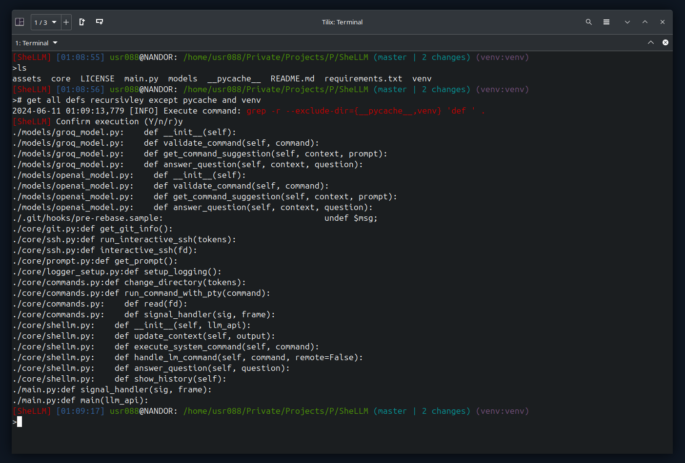
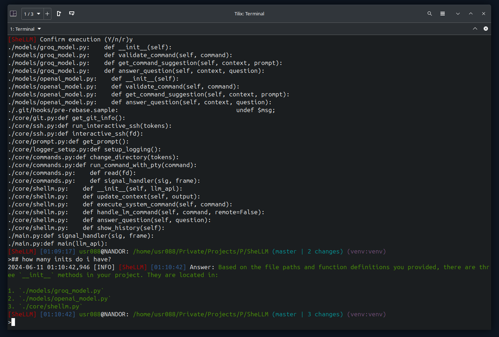

<p align="center"></p>
<h3 align="center">Let the AI  in your terminal </h3>
<hr>

 
  [](http://github.com/badges/stability-badges)

<h3 align="center">🤖 Powered by [INSERT LLM HERE] 🤖</h3>

<h3>NOTE: This is a PoC in very, very early stage of development (but it works). Help is most welcome!<h3>

<p align="center">
  <a href="https://skillicons.dev">
    
  </a>
</p>

# SheLLM

A Proof of Concept (PoC) for a **shell wrapper** that integrates LLM models like **ChatGPT/Groq** for **command suggestions** and **context-aware interactions** (don't worry, it won't take over your computer, I promise).

This shell wrapper can **execute commands** and provide suggestions based on the context, enhancing the overall user experience.

> It can execute commands:



> It can also answer questions:



> Here is a quick recording of SheLLM in action:


*Disclaimer: If you are using SheLLM with a third party API, please make sure not share any sensitive information or data with the AI model.*

## 📑 Table of Contents

- [SheLLM](#shellm)
  - [📑 Table of Contents](#-table-of-contents)
  - [🚀 Quickstart](#-quickstart)
  - [✨ Features](#-features)
  - [🎯 Motivation](#-motivation)
  - [🐞 Known Issues](#-known-issues)
  - [🛤️ Roadmap](#️-roadmap)
  - [🧪 Tests](#-tests)
  - [🤝 Contribution](#-contribution)
  - [📜 License](#-license)
  - [🙏 Acknowledgements](#-acknowledgements)

## 🚀 Quickstart

Pre-requisites:

```bash
# - Python 3.12 + python3.12-venv (maybe a lower version will work too)
# - Groq (https://console.groq.com/keys) or OpenAI (https://platform.openai.com/api-keys) API key
git clone https://github.com/thereisnotime/SheLLM.git && cd SheLLM
cp .env.example .env # Update .env with your configuration and API keys.
python3 -m venv venv && source venv/bin/activate
pip3 install -r requirements.txt
```

Usage:

```bash
python3 main.py --llm-api=openai
# or
python3 main.py --llm-api=groq
```

Now you can ask for a command with `# find all .py files` or ask a question with `## total size of all found .py files`.

## ✨ Features

- **ChatGPT/OpenAI Support**: Integrate with ChatGPT/OpenAI in your terminal.
- **Groq Support**: Integrate with Groq in your terminal.
- **Shell Wrapper**: Provides suggestions and can execute commands directly.
- **Context Awareness**: Remembers previous commands and their outputs.
- **Command Confirmation**: Prompts for confirmation before executing commands.
- **Retry Mechanism**: Includes a retry mechanism for prompt re-generation.
- **Shortcut Support**: Compatible with most standard terminal shortcuts.

## 🎯 Motivation

The motivation behind SheLLM is to create a more intelligent shell that assists users with suggestions and context-awareness. By leveraging a language model, SheLLM aims to understand the context of commands and provide relevant suggestions, making the shell experience more efficient and user-friendly.

## 🐞 Known Issues

The following are the current known issues with SheLLM:

- [ ] SheLLM does not handle SSH stream properly (could be better).
- [ ] SheLLM does not handle error exits properly.
- [ ] SheLLM breaks the standard terminal shortcuts when in an SSH session.
- [ ] SheLLM get stuck in prompt generation while CTRL+C is pressed.
- [ ] SheLLM breaks scroll in the terminal after it crashes.
- [ ] SheLLM's context should take the last output with higher priority and not the previous commands.

## 🛤️ Roadmap

Feel free to contribute to the roadmap by creating issues or pull requests with new features or improvements.

- [x] Add support for ChatGPT.
- [x] Add Groq support.
- [ ] Add support for self-hosted LLM models.
- [ ] Improve prompts for questions, commands and validation.
- [ ] Add a mechanic that can generate command from the answer to a question.
- [ ] Improve code structure and quality (e.g. add type hints, docstrings, etc.).
- [x] Add a proper logging mechanism.
- [ ] Add context size warnings and automatic context cleanup.
- [ ] Proper handling of error exits.
- [ ] Build PyPI package.
- [ ] Add fancy GitHub Actions CI/CD pipelines with labels and badges.
- [x] Improve repository structure.
- [ ] Add env/config validation on load (maybe Pydantic).
- [ ] Create tests setup for the main features.
- [ ] Add Jinja2 support for prompt customization.
- [ ] Add a CONTRIBUTING.md file.
- [ ] Handle proper stream disconnects (SSH/top etc.) and improve SSH experience overall.
- [ ] Add optional secret check for requests sanitization.
- [ ] Add optional PII check for requests sanitization.
- [ ] Add a mechanism to detect errors after commands execution and ask to solve them.
- [ ] Add configuration support (LLM type, LLM model config per command type, token, history size, trigger chars, execute command without confirmation).
- [ ] Add wrapper for screen (auto start and stop).
- [ ] Add `fzf` support with suggestion mode for commands + shortcut to return to previous choice.
- [x] Remove SheLLM prompts from history (intercept).
- [ ] Add detailed SheLLM history (with timestamps) for each session.
- [ ] Add local logging for full terminal context for future embeddings optimization.
- [ ] Do not approve PRs from John Connor 🤖.
- [x] Add mechanism to handle streaming output (e.g. tail -f, top, etc.).
- [x] Add TAB completion for commands.
- [ ] Add support for PowerShell.

## 🧪 Tests

Test the following cases/scenarios:

- [x] Test if it works while in an SSH session and if remote server will save prompt history. - works, prompt not saved.
- [ ] Test how long history can be used/contextualized.
- [ ] Test if it works with different shells.
- [ ] Test if it handles errors.
- [ ] Test in tmux.
- [ ] Test in screen.
- [ ] Test if it will work better outside of venv when multiplexed.
- [ ] Test context handling.

## 🤝 Contribution

We welcome contributions to SheLLM! You can help by creating issues or submitting pull requests. If coding isn't your thing, you can still support the project by testing it with different shells, terminals, and OS versions (see the Tests section above for details). If you have questions or need assistance, join our discussions group on Telegram:


## 📜 License

Check the [LICENSE](LICENSE) file for more information.

## 🙏 Acknowledgements

- [OpenAI](https://openai.com) for providing their Python library and nice API.
- [Groq](https://groq.com) for providing their Python library and nice API.
- [colorama](https://pypi.org/project/colorama/) for providing an easy way to color the terminal output.
- [python-dotenv](https://pypi.org/project/python-dotenv/) for providing an easy way to load environment variables from `.env` file.
- [click](https://pypi.org/project/click/) for providing an easy way to create command-line interfaces.
